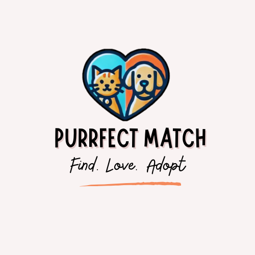

# PurrfectMatch — Milestone 1

## Team Members
- **Comeagă Ana-Maria**  
- **Popa Ruxandra-Georgiana**

## Project Theme
**PurrfectMatch** is a modern web application designed to connect pet lovers with local animal shelters. The platform simplifies the pet adoption process while offering shelters a suite of management tools to handle animal profiles, adoption requests, and user communication efficiently.

## Project Description
PurrfectMatch bridges the gap between potential adopters and animal shelters through an intuitive, interactive platform. It provides features that benefit both end users (adopters) and shelter administrators, ensuring a smooth, transparent, and responsible adoption process.

### Core Objectives
- Facilitate pet discovery and matching based on compatibility, lifestyle, and preferences.
- Streamline adoption management for shelters with digital workflows and record keeping.
- Foster a pet-loving community through interactive and educational tools.

## Key Functionalities

| Stakeholder | Functionality | Description |
|-------------|---------------|-------------|
| Adopters (Users) | Adoption Portal | Browse/search pets, view detailed profiles with images, medical history, and behavioral assessments. |
| Admins (Shelters) | Shelter Management | CRUD operations for pet profiles, dashboard for approving/rejecting adoption requests. |
| All Users | Community Hub | Integrated forums and post-sharing features to build a supportive user environment. |
| System | Authentication | Secure user registration and login with email and social media authentication. |

## How It Works
1. **User Registration:** Adopters and shelters can register using email or social media authentication.  
2. **Pet Discovery:** Browse or filter animals based on various attributes.  
3. **Adoption Process:** Submit a request, communicate with the shelter, and track progress.  
4. **Shelter Management:** Admins manage animals, requests, and user feedback.  
5. **Community Interaction:** Users share experiences and tips in forums.

## Proposed Architecture & Technology Stack
- **Frontend:** HTML, CSS,  JavaScript  
- **Backend:** Java with Spring Boot (Controllers, Services, Repositories)  
- **Database:** MariaDB  
- **Deployment:** Docker for containerized, consistent environments  

The architecture follows a modular and scalable design, allowing easy expansion in future development.

## Design Patterns
The following **five non-trivial design patterns**, including essential architectural principles, will be utilized to address specific structural and behavioral challenges within the system.

### 1. Repository Pattern (Architectural Foundation)
**Pattern Type:** Architectural / Structural Focus (Essential Enterprise Pattern)  

**Problem Addressed:** Tight coupling between the application's business logic and the underlying persistence technology (MariaDB). Implementing data access directly within service classes (e.g., `UserServiceImpl`) violates the Principle of Separation of Concerns.  

 **Justification:** The Repository Pattern abstracts all database operations. Dedicated classes (e.g., `PetRepository`, `UserRepository`) provide a collection-like interface for the services layer to interact with domain objects, insulating business logic from database query language or ORM specifics.

 **Advantage:** Without a repository layer, changing the database or updating persistence frameworks would require extensive modifications across multiple service files, hindering maintenance and increasing refactoring cost. The repository layer ensures separation of concerns and simplifies unit testing by allowing repositories to be easily mocked.

### 2. Facade Pattern (Structural)
 **Pattern Type:** Structural 

 **Problem Addressed:** Simplification of complex, multi-step business transactions. The end-to-end adoption workflow involves validating the user, updating pet status, logging the transaction, and initiating communication, requiring coordination of multiple services and repositories.  

 **Justification:** The Facade Pattern is implemented in the service layer (e.g., within a class like `AdoptionServiceImpl`). This class acts as a unified interface (facade) that hides the intricate orchestration of underlying services (`PetService`, `UserService`, `NotificationService`) from the client layer (controllers).

 **Advantage:** Without a facade, controllers like `AdoptController` would become bloated, managing multiple service dependencies and dictating transaction order, violating the Law of Demeter and making the code hard to maintain. The facade centralizes and simplifies the transaction boundary.

### 3. Factory Method Pattern (Creational)
 **Pattern Type:** Creational 

 **Problem Addressed:** Managing instantiation of diverse domain entities while keeping creation logic flexible and decoupled from client code. Applies to creating specific pet subtypes or different user roles (e.g., Admin vs. Standard).  

 **Justification:** The Factory Method Pattern defines an interface for creating objects, allowing subclasses (concrete factories) to decide which concrete class to instantiate. For example, `Pet.java` ensures correct instantiation of `DogProfile` vs. `CatProfile`, or `StandardUser` vs. `AdminUser` (based on `Role.java`). 

 **Advantage:** This design adheres to the Open/Closed Principle (OCP). Using direct constructors (e.g., `new Pet(...)`) would require modifying all client code when new pet species or user roles are added. The factory provides a flexible extension point without altering existing implementation code.

### 4. Strategy Pattern (Behavioral)
 **Pattern Type:** Behavioral 

**Problem Addressed:** Providing algorithmic flexibility for core user-facing features, such as search, filtering, and compatibility matching in the Adoption Portal.  

 **Justification:** The Strategy Pattern defines a family of algorithms, encapsulating each into a separate class. A `Strategy` interface (e.g., for search or sorting logic) allows interchangeable concrete implementations (breed-based filtering, age-based sorting). The service layer dynamically selects and executes the appropriate strategy based on criteria submitted via `ProductSearchCriteria.java`. 

 **Advantage:** Using large conditional statements (if/else or switch) would result in monolithic, hard-to-maintain code violating OCP. Strategy isolates varying business logic, making individual algorithms testable and easily substitutable.

### 5. Singleton Pattern (Creational)
**Pattern Type:** Creational 

 **Problem Addressed:** Ensuring a critical class responsible for system-wide configuration or resource management has only one instance during the application's lifecycle. Prevents resource conflicts and inconsistent state.

 **Justification:** The Singleton Pattern is used for managing global application resources, particularly in the `config` package (e.g., `DataInitializer.java`, `SecurityConfig.java`). These components must be managed centrally and initialized only once to set up the environment and security rules consistently.  

 **Advantage:** Without the singleton constraint, multiple instances of a configuration manager could exist, leading to inconsistent settings, duplicated initialization, or security vulnerabilities. Singleton guarantees a single point of control and resource access.

## Conclusion
The planned architecture is designed to be modular and scalable, which will allow easy expansion in future development.

